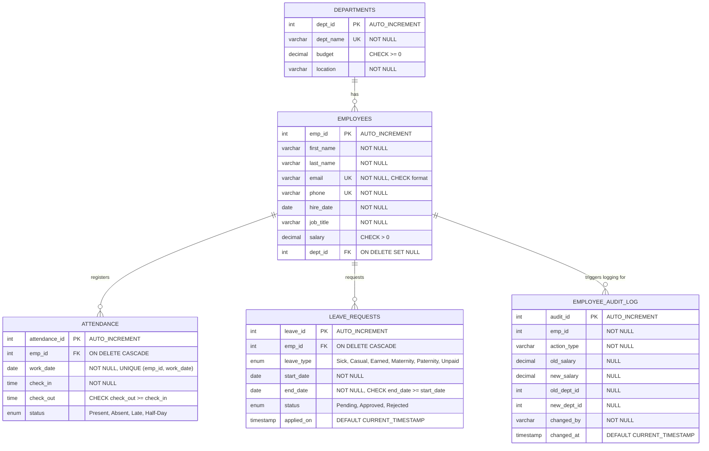

# Entity Relationship (ER) Diagram - Employee Attendance Tracker

This document contains the Entity Relationship diagram and details the database relationships for the Employee Attendance Tracker database system.

## Mermaid ER Diagram

The following Mermaid diagram displays the tables, fields, constraints, primary keys (PK), and foreign keys (FK) that establish referential integrity.

## Relationships Explanation

### 1. Departments to Employees (1:N / One-to-Many)
- **Description**: A single department can have multiple employees assigned to it. An employee can belong to at most one department at any time.
- **Implementation**: The `Employees` table contains the foreign key `dept_id` referencing the `Departments` table's primary key `dept_id`.
- **Referential Integrity**: `ON DELETE SET NULL` is applied. If a department is deleted, the employees in that department will have their `dept_id` set to `NULL` (unassigned) rather than being deleted, preserving employee records.

### 2. Employees to Attendance (1:N / One-to-Many)
- **Description**: An employee can have many daily attendance records over time. Each attendance record belongs to exactly one employee.
- **Implementation**: The `Attendance` table contains the foreign key `emp_id` referencing the `Employees` table's primary key `emp_id`.
- **Referential Integrity**: `ON DELETE CASCADE` is applied. If an employee record is deleted, all their attendance history is automatically removed.
- **Unique Constraint**: The combination of `(emp_id, work_date)` is marked as `UNIQUE` to ensure an employee can have at most one attendance record per day.

### 3. Employees to Leave Requests (1:N / One-to-Many)
- **Description**: An employee can submit multiple leave requests over time. Each leave request belongs to one employee.
- **Implementation**: The `LeaveRequests` table contains the foreign key `emp_id` referencing the `Employees` table's primary key `emp_id`.
- **Referential Integrity**: `ON DELETE CASCADE` is applied. If an employee is deleted, all their associated leave requests are removed.

### 4. Employees to Employee Audit Log (1:N / One-to-Many - Conceptual Tracking)
- **Description**: Changes made to an employee's profile (like salary adjustments or department transfers) are captured in the audit log for historical tracking and compliance.
- **Implementation**: Trigger-based insertions log metadata to `EmployeeAuditLog` on modifications to the `Employees` table.
